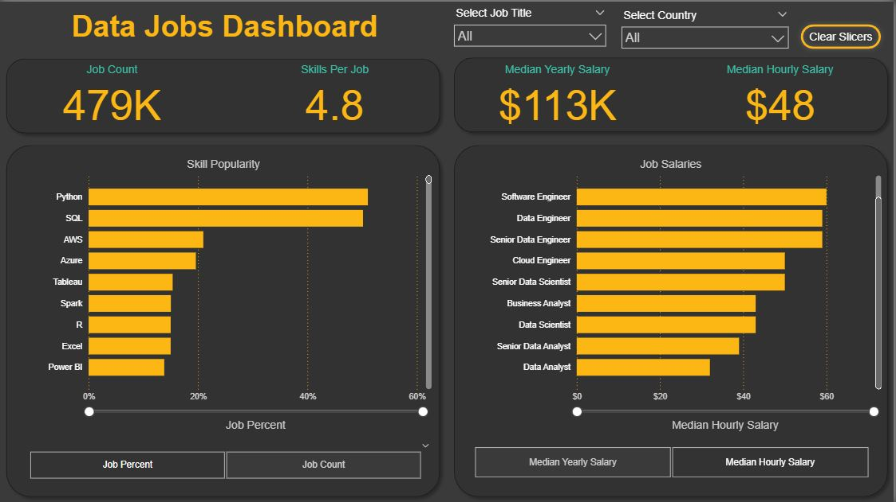

# Data Jobs Dashboard (Power BI)



## Introduction
A single-page Power BI report analysing **data-job postings** (roles, skills, pay).  
The focus is a clean model, simple measures, and a professional dark layout for quick exploration.

**Download the .pbix:** 👉 [Google Drive (Anyone with the link)](https://drive.google.com/file/d/1q9asRplq7w1jE4bmv3JEoUiIgVtBYtdv/view?usp=sharing)

---

## Skills Showcased
- **Data modelling (lightweight):** data types, relationships, number formats.
- **Measures:** job count, **median yearly** and **median hourly** salary.
- **Parameters:** button toggle between yearly/hourly salary.
- **Core visuals:** KPI cards + bar charts (skills popularity, job salaries).
- **Interactivity:** slicers for **Job Title** and **Country**, **Clear Slicers** action.
- **Design:** consistent palette (charcoal + accent yellow), legible typography, spacing.

---

## Dashboard Overview
**Top row**
- **KPI cards:** Job Count, Skills per Job, Median Yearly Salary, Median Hourly Salary.
- **Global slicers:** Job Title, Country, and a **Clear Slicers** button.

**Bottom row**
- **Skill Popularity (bar)** – frequency of skills in postings.
- **Job Salaries (bar)** – salary comparison by role with parameter toggle (yearly/hourly).

---

## How to Use
1. Open the `.pbix` in **Power BI Desktop** (latest build recommended).
2. Filter with **Job Title** and **Country**.
3. Switch pay view using the **Median Yearly / Median Hourly** buttons.
4. Click **Clear Slicers** to reset.

---

## Key Measures (illustrative)
```DAX
Job Count =
COUNTROWS ( job_postings_fact )

Median Yearly Salary =
MEDIAN ( job_postings_fact[salary_year_avg] )

Median Hourly Salary =
MEDIAN ( job_postings_fact[salary_hour_adjusted_v2] )

Fallback example (if one salary field is blank)
Final Salary =
IF (
    NOT ISBLANK ( job_postings_fact[salary_year_avg] ),
    job_postings_fact[salary_year_avg],
    job_postings_fact[salary_hour_adjusted_v2]
)
```
---

## Conclusion
This dashboard converts raw job-posting data into a **clear, interactive overview** with:
- **KPI cards** for market size (Job Count), skills density, and typical pay.
- **Bar charts** for **Skill Popularity** and **Job Salaries**, with a parameter toggle for **Median Yearly / Median Hourly** salary.
- **Slicers** (Job Title, Country) and a **Clear Slicers** action for quick resets.
